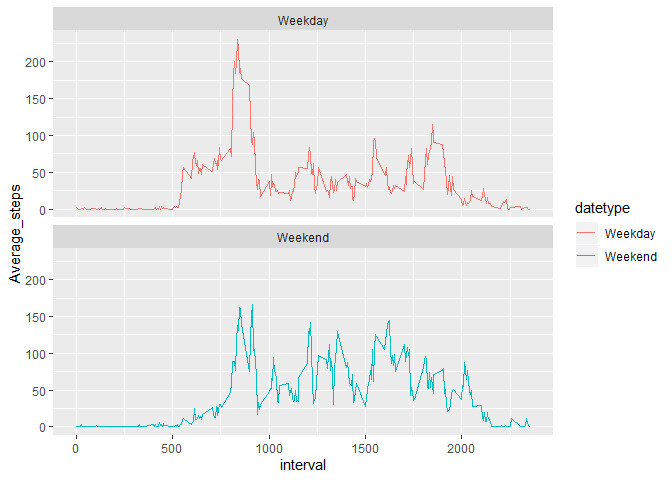

Loading and preprocessing the data
----------------------------------

    library(ggplot2)
    library(dplyr)
    library(tidyr)
    library(lubridate)

    activity <- read.csv("activity.csv")
    activity <- drop_na(activity)
    activity$date <- ymd(activity$date)

What is mean total number of steps taken per day?
-------------------------------------------------

    steps_perday <- activity %>% group_by(date) %>% summarise(total_steps = sum(steps))

    g <- ggplot(steps_perday, aes(total_steps))
    g + geom_histogram(binwidth = 2500) 

    mean(steps_perday$total_steps)

    ## [1] 10766.19

    median(steps_perday$total_steps)

    ## [1] 10765

What is the average daily activity pattern?
-------------------------------------------

    time_interval <- activity %>% group_by(interval) %>% summarise(interval_avg_steps = mean(steps))

    ggplot(data = time_interval, aes(x = interval, y = interval_avg_steps))+
      geom_line(color = "#00AFBB", size = 2)

    time_interval[which.max(time_interval$interval_avg_steps), ]$interval

    ## [1] 835

Imputing missing values
-----------------------

    activity_full <- read.csv("activity.csv")

    sum(is.na(activity_full$steps))

    ## [1] 2304

    for (i in 1:length(activity_full$steps)){
            if (is.na(activity_full$steps[i] == TRUE)){        
            activity_full$steps[i] <- time_interval$interval_avg_steps[match(activity_full$interval[i], time_interval$interval)]  
            } 
    }

    steps_perday2 <- activity_full %>% group_by(date) %>% summarise(total_steps = sum(steps))

    g <- ggplot(steps_perday2, aes(total_steps))
    g + geom_histogram(binwidth = 2500) 

    mean(steps_perday2$total_steps)

    ## [1] 10766.19

    median(steps_perday2$total_steps)

    ## [1] 10766.19

Are there differences in activity patterns between weekdays and weekends?
-------------------------------------------------------------------------

    activity_full$date <- ymd(activity_full$date)

    activity_full$datetype <- sapply(activity_full$date, function(x) {
            if (weekdays(x) == "Saturday" | weekdays(x) =="Sunday") 
                    {y <- "Weekend"} else 
                    {y <- "Weekday"}
                    y
            })

    activity_full$datetype <- as.factor(activity_full$datetype)

    wtime_interval <- activity_full %>% group_by(interval, datetype) %>% summarise(Average_steps = mean(steps))

    ggplot(data = wtime_interval, aes(x = interval, y = Average_steps, color = datetype))+
      geom_line(size = .5) + facet_wrap(~datetype, nrow=2)

